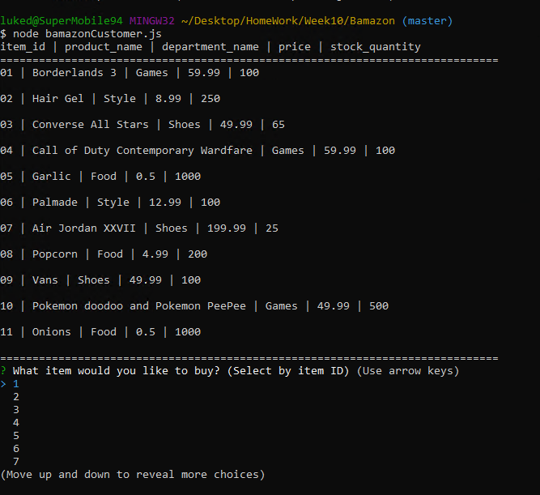
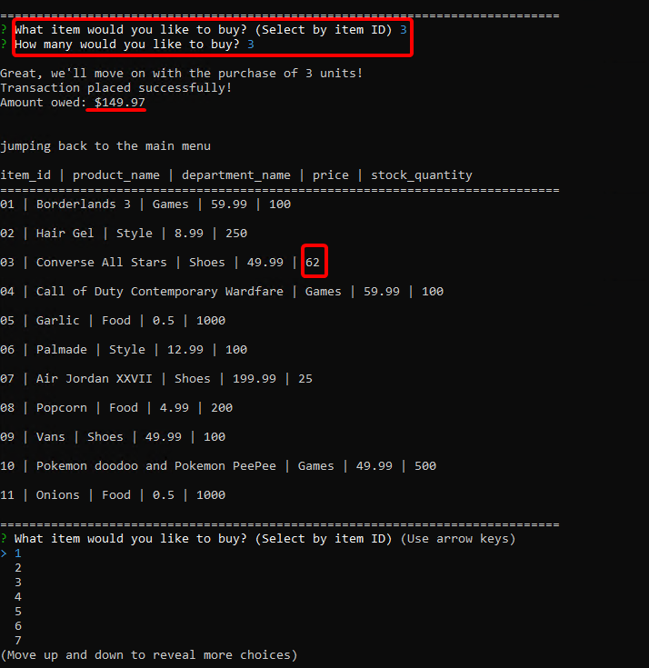
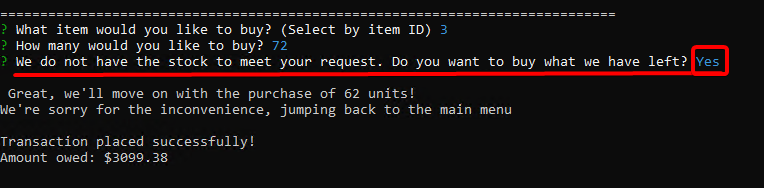
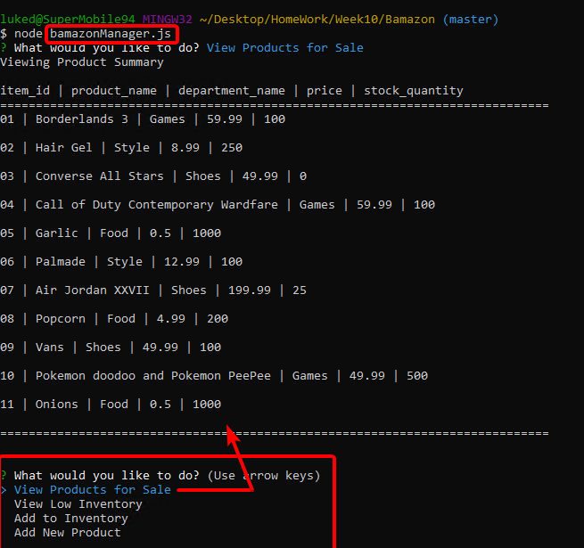
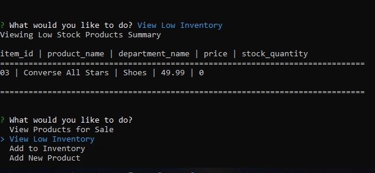
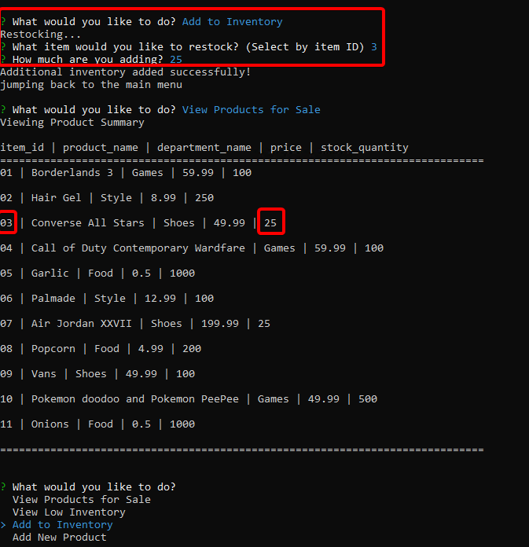
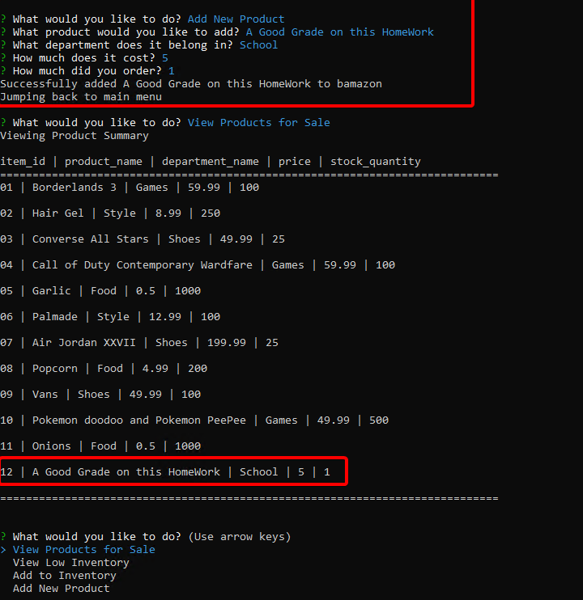

# Bamazon

<h2>Customer Page<h2>

Bamazon is a CLI app used to mimic an online storefront. Currently it has 2 views. One is the customer interface which on startup, displays the current items for sale along with other useful information for each product (Detailed in Screenshot)

After seeing the initial list, the user (customer) can then select an item to buy (by item ID). After selecting an item, the user specifies how many units they'd like to buy. If the store has stock, the transaction will go through, and display how much it cost, should you check the inventory, the user will see the stock for the item diminished by the amount of units bought by the customer.

If the user want s more than what's available, Bamazon will apologize for the inconvenience, and ask the user if they'd like to buy the remaining stock instead. If the user accepts, the transaction goes through and sets inventory to 0 for that item. Otherwise if the user says 'no', the transaction will not take place

<h2>Manager Page<h2>

  
There is also a manager view to bamazon. On load up, the user (the bamazon manager) is prompted with a menu of four items.
 
<strong>View Products For Sale</strong> will display the current inventory. Similar to the customer page

 
<strong>View Low Inventory</strong> will display items with less then 5 units in inventory.

  
<strong>Add To Inventory</strong> Will allow the manager to specify what item they'd like to add to the storewares on top of how many they'd like to add.

<strong>Add New Product</strong> Will allow the manager to add a completely new item to the store wares. The manager needs to specify what the item is, which department it belongs in, how much each unit is, and how many to initially add.

